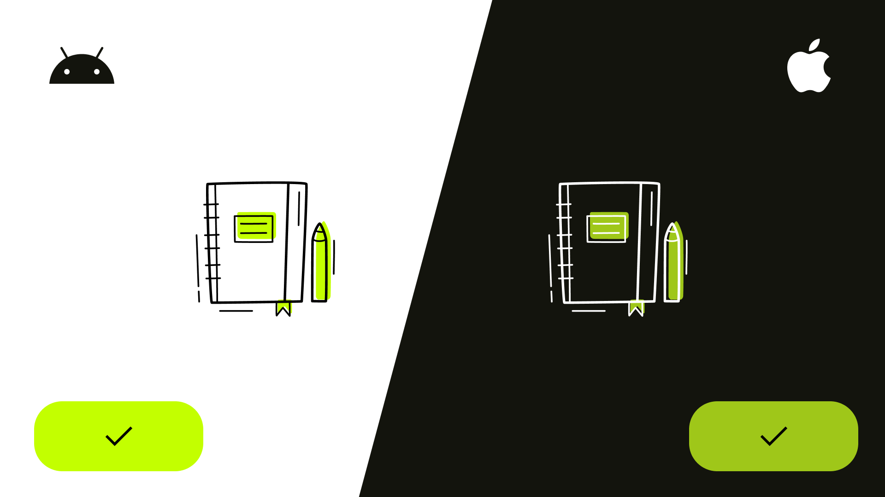

# Compose Multiplatform (Android/iOS) - Mobile App Development

  <a href="https://www.udemy.com/course/to-do-app-with-jetpack-compose-mvvm-android-development/?referralCode=7A702385AEE43E3E39C5" align="center">Online Course</a>

  

